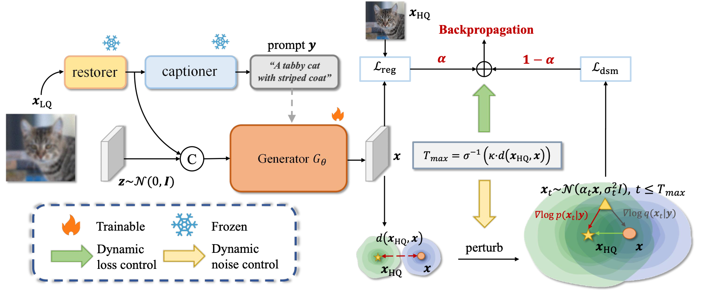

# InstaRevive
This is the official implementation of InstaRevive: One-Step Image Enhancement via Dynamic Score Matching

# FlowIE: Efficient Image Enhancement via Rectified Flow (CVPR 2024)

> [Yixuan Zhu](https://eternalevan.github.io/)\* $\dagger$, Haolin Wang\* , [Ao Li](https://rammusleo.github.io/), [Wenliang Zhao](https://wl-zhao.github.io/)\*, [Yansong Tang](https://andytang15.github.io/), [Jie Zhou](https://scholar.google.com/citations?user=6a79aPwAAAAJ&hl=en&authuser=1), [Jiwen Lu](http://ivg.au.tsinghua.edu.cn/Jiwen_Lu/), [Lei Chen](https://andytang15.github.io/) $\ddagger$
> 
> \* Equal contribution &nbsp; $\dagger$ Project leader &nbsp; $\ddagger$ Corresponding author

[**[Paper]**](https://openreview.net/pdf?id=G1CN7R5qwE)

The repository contains the official implementation for the paper "InstaRevive: One-Step Image Enhancement via Dynamic Score Matching" (**ICLR 2024**).

We propose InstaRevive, a straightforward yet powerful image enhancement framework that employs score-based diffusion distillation to harness potent generative capability and minimize the sampling steps.

## 📋 To-Do List

* [x] Release model and inference code.
* [x] Release code for training dataloader.


## 💡 Pipeline



<!-- ## ⭐️ Performance
Coming soon! -->


## 😀Quick Start
### ⚙️ 1. Installation

We recommend you to use an [Anaconda](https://www.anaconda.com/) virtual environment. If you have installed Anaconda, run the following commands to create and activate a virtual environment.
``` bash
conda create -n instarevive python==3.9.0
conda activate instarevive
conda install pytorch==2.0.1 torchvision==0.15.2 torchaudio==2.0.2 pytorch-cuda=11.7 -c pytorch -c nvidia

git clone https://github.com/EternalEvan/InstaRevive.git

cd InstaRevive
pip install -r requirements.txt
```

### 🗂️ 2. Download Checkpoints

Please download our pretrained checkpoints from [this link](https://cloud.tsinghua.edu.cn/d/4fa2a0880a9243999561/) and put them under `./weights`. The file directory should be:

```
|-- checkpoints
|--|-- InstaRevive_sr_v1.ckpt
...
```

### 📊 4. Test & Evaluation

You can test InstaRevive with following commands:

```bash
python inference.py --ckpt ./weights/InstaRevive_v1.ckpt  --input /data/testdata/  --output ./outputs/bsr_exp --sr_scale 4
```
- **Quick Test**

For a quick test, we collect some test samples in `./assets`. You can run the demo for real-world ISR:
```bash
python inference.py --ckpt ./weights/InstaRevive_v1.pth  --input ./assets/inputs/  --output ./outputs/bsr_exp --tiled --sr_scale 1
```
You can use `--tiled` for patch-based inference and use `--sr_scale` tp set the super-resolution scale, like 2 or 4. You can set `CUDA_VISIBLE_DEVICES=1` to choose the devices.
<!--```bash
CUDA_VISIBLE_DEVICES=0 \
torchrun \
--master_port 29591 \
--nproc_per_node 1 \
eval.py \
--cfg ./configs/main_train.yml \
--exp_id="main_train" \
--distributed \
```-->

The evaluation process can be done with one Nvidia GeForce RTX 3090 GPU (24GB VRAM). You can use more GPUs by specifying the GPU ids.


## 🫰 Acknowledgments

We would like to express our sincere thanks to the author of [DiffBIR](https://github.com/XPixelGroup/DiffBIR) for the clear code base and quick response to our issues. 

We also thank [CodeFormer](https://github.com/sczhou/CodeFormer), [Real-ESRGAN](https://github.com/xinntao/Real-ESRGAN) and [LoRA](https://github.com/cloneofsimo/lora), for our code is partially borrowing from them.

The new version of FlowIE based on Denoising Transformer (DiT) structure will be released soon! Thanks the newest works of DiTs, including [PixART](https://github.com/PixArt-alpha/PixArt-sigma) and [Stable Diffusion 3](https://huggingface.co/stabilityai/stable-diffusion-3-medium).

## 🔖 Citation
Please cite us if our work is useful for your research.

```
@misc{zhu2024flowie,
      title={FlowIE: Efficient Image Enhancement via Rectified Flow}, 
      author={Yixuan Zhu and Wenliang Zhao and Ao Li and Yansong Tang and Jie Zhou and Jiwen Lu},
      year={2024},
      eprint={2406.00508},
      archivePrefix={arXiv},
      primaryClass={cs.CV}
}
```
## 🔑 License

This code is distributed under an [MIT LICENSE](./LICENSE).

